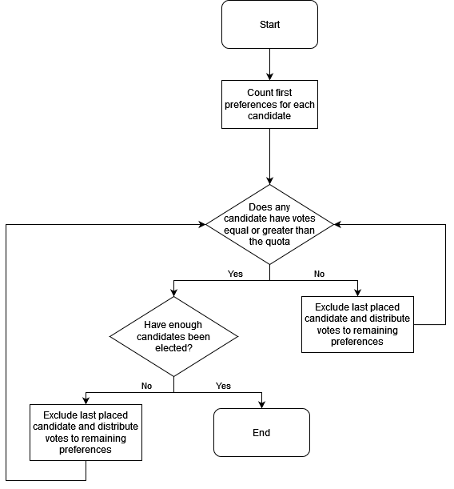

If you would like to be further involved in the Engineering Society, you can apply to run for a position in EngSoc. Many positions in EngSoc are elected, including all of our Officers, Class Reps, and Board of Directors Reps, whereas our Project Directors are appointed via interview. In addition, there are many positions in Discipline Clubs and Ex-Officio groups that are also elected through EngSoc's elections process.

Of course, all members of EngSoc can vote in our elections, as well as their respective discipline clubs.

<a class="button is-primary" href="http://vote.skule.ca">Vote!</a>

## Apply

Elections will be announced by the CRO (Chief Returning Officer) via mass email, Skule Digest, and the announcement feed found below. Students wishing to nominate themselves must fill out the nomination form, available in the EngSoc office, and hand it in before the end of the nomination period

## Rules and Procedures

The elections process varies depending on the position. Elections are run by the CRO with the help of DROs (Deputy Returning officers) to ensure a fair and unbiased election. As such, EngSoc has put in place rules regarding nominations, campaigning, re-elections etc...
            
For more information about the election process, refer to [Bylaw 3](/about/governing_documents)

> <b class="speakerpersono">Chief Returning Officer</b>
> Lavneet Singh <small class="speakpersono-text">Overseen by the Speaker</small>
> 
> The CRO is a neutral body who conducts EngSoc elections, ensuring that they are run fairly and democratically. Along with their Deputy Returning Officers (or DROs) as part of the Office of Returning Officers (or ORO), they spend much of the year refining the election policies and scheduling the elections for the year.
> 
> <a class="button is-small speakpersono" href="mailto:cro@skule.ca">Email</a>

> <b class="speakerpersono">Deputy Returning Officers</b>
> 
> As part of the Office of Returning Officers (ORO), the DRO collaborates with the CRO to ensure the entire elections process remains transparent, fair, and trustworthy for all candidates and voters. 
>  
> > <b class="speakerpersono">Abisha Kugathasan</b>
> >
> > <a class="button is-small speakpersono" href="mailto:abisha.kugathasan@mail.utoronto.ca">Email</a>
>
> > <b class="speakerpersono">Genevieve Beirne</b>
> >
> > <a class="button is-small speakpersono" href="mailto:genevieve.beirne@mail.utoronto.ca">Email</a>
>
> > <b class="speakerpersono">Jingya Liu</b>
> >
> > <a class="button is-small speakpersono" href="mailto:jingya.liu@mail.utoronto.ca">Email</a>
>
> > <b class="speakerpersono">Katie Hung</b>
> >
> > <a class="button is-small speakpersono" href="mailto:katie.hung@mail.utoronto.ca">Email</a>
>
> > <b class="speakerpersono">Abdirahman Nuh</b>
> >
> > <a class="button is-small speakpersono" href="mailto:abdirahman.nuh@mail.utoronto.ca">Email</a>
>
> > <b class="speakerpersono">Aaryan Fredrick</b>
> >
> > <a class="button is-small speakpersono" href="mailto:aaryan.fredrick@mail.utoronto.ca">Email</a>
>
> > <b class="speakerpersono">Bowen Wang</b>
> >
> > <a class="button is-small speakpersono" href="mailto:bbowen.wang@mail.utoronto.ca">Email</a>
>
> > <b class="speakerpersono">Lina Le</b>
> >
> > <a class="button is-small speakpersono" href="mailto:Linanguyen.le@mail.utoronto.ca">Email</a>

### Voting System

EngSoc's elections are conducted using a single transferrable voting system using the Gregory method, with a Droop quota. In English, this means that on your ballot, you rank your choices. Then, if the person you prefer the most doesn't win, your vote is transferred to the person you prefer the second most, then third most, and so on.

The process gets a little more complicated if there is more than one seat to fill. Here's the exact algorithm:

#### Quota

The "quota" referred to above is how we make sure that at a majority of people don't have another candidate they prefer over the winner. The formula is:


$$\text{votes needed to win} = \left\lfloor\frac{\text{valid votes cast}}{\text{seats to fill} + 1}\right\rfloor + 1$$

For example, if there is one seat to fill and 10 people voted, no candidate is allowed to win unless they have at least 
$$\left\lfloor\frac{10}{1 + 1}\right\rfloor + 1 = 6$$
 votes. Likewise, for 10 people and two seats, each candidate needs at least 4 votes to win.


#### Vote transfers

As explained above, when a candidate is elected or eliminated, their votes are transferred to other candidates.

When a candidate is eliminated, the vote goes to the next usable candidate on the ballot instead. If there is no usable candidate remaining on the ballot, the vote goes to the "exhausted" or "non-transferrable" pile.

When a candidate is elected with more votes than necessary to win, the _surplus_ votes (that is, the number of votes above the quota they received) get transferred to each voter's next choice. However, because only the excess of the votes are being transferred, the votes are scaled down when being transferred.

The formula to determine the value transferred is:


$$\left(\frac{\text{total value of candidate's votes} - \text{quota}}{\text{total value of candidate's votes}}\right) \times \text{value of each vote when the candidate is elected}$$

Say a candidate received 12 votes in the first round and the quota is 10. All 12 people who voted for this candidate would have their votes transferred to their second choice candidates at a value of 
$$\left(\frac{12 - 10}{12}\right) \times 1 = 0.2$$
.


## Frequently Asked Questions
**Q: How do I vote?**

**A:** During the voting period, you can go to [vote.skule.ca](https://vote.skule.ca) and log in with your UTORid and password to vote. If you encounter any difficulties when voting, please contact the CRO at [cro@skule.ca](mailto:cro@skule.ca).

**Q: How do I run for a position? Which positions are open?**

**A:** When there is an upcoming election, you will receive an email with an _Election Notice_. The election notice will outline which positions are up for election and how to run. For most elected positions, you need to be nominated by a minimum number of eligible voters. [More information](#apply).

**Q: How are the votes counted? Why do I have a fractional number of votes?**

**A:** EngSoc's elections are conducted using a single transferrable voting system using the Gregory method, with a "Droop quota". Please see [above](#voting-system) for more details. For why you might have a fractional number of votes, please see [here](#vote-transfers)
