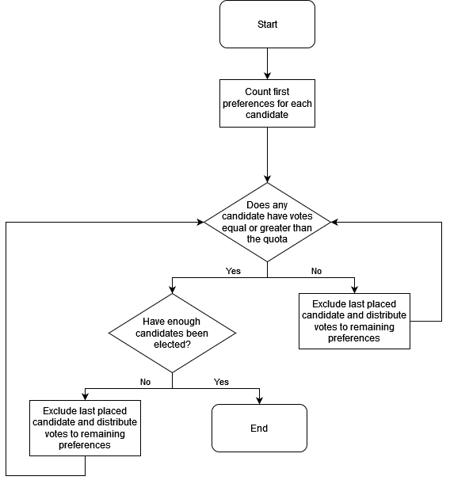

If you would like to be further involved in the Engineering Society, you can apply to run for a position in EngSoc. Many positions in EngSoc are elected, including all of our Officers, Class Reps, and Board of Directors Reps, whereas our Project Directors are appointed via interview. In addition, there are many positions in Discipline Clubs and Ex-Officio groups that are also elected through EngSoc's elections process.

Of course, all members of EngSoc can vote in our elections, as well as their respective discipline clubs.

<a class="button is-primary" href="http://vote.skule.ca">Vote!</a>

## Why Vote?

Voting is your most direct way to influence the engineering undergraduate experience at the University of Toronto. Below are several reasons why your participation matters.

**1. Direct Influence on Your Education**

From academic advocacy to faculty relations, the people you elect represent your interests to the University. By voting for your Class Representatives and Officers, you ensure that the voices speaking to the Faculty reflect your actual concerns and values. 

Some academic matters that Class Representatives routinely contest include:

- How marks are assessed
- Fairness of assessments
- Quality of course instruction

**2. Control Over Your Student Fees**

EngSoc manages a significant financial portfolio (supported by your student fees!) that funds clubs, design teams, community initiatives, and much more. Your vote decides how funds should be allocated (e.g. levy votes) and who oversees these allocations, ensuring that your student fees are invested in the services and events that matter most to you.

**3. Accountability and Governance**

The Board of Directors serves as the ultimate authority for the Society. By electing Board Representatives, you are choosing the individuals responsible for holding student leaders accountable and ensuring the Society operates transparently and in the best interest of all your “Skulemates”.

**4. Shaping the Future EngSoc Culture**

Whether it is overseeing day-to-day operations or launching new student services, the Officers you elect set the tone for the school year. Voting allows you to choose the vision and leadership style that you want to see during your undergraduate degree at Skule.

## Apply

Elections will be announced by the CRO (Chief Returning Officer) via mass email, Skule Digest, and the announcement feed found below. Students wishing to nominate themselves must fill out the nomination form, available in the EngSoc office, and hand it in before the end of the nomination period

## Rules and Procedures

The elections process varies depending on the position. Elections are run by the CRO with the help of DROs (Deputy Returning officers) to ensure a fair and unbiased election. As such, EngSoc has put in place rules regarding nominations, campaigning, re-elections etc...
            
For more information about the election process, refer to Bylaw 3:

  
 

  <b class="speakerpersono">Bylaw 3</b>

  

    

 

    

 

    

 

    

 

    

 

    

 

    

 

    

 

    

 

    

 

    

 

    

 

    

 

    

 

    

 

    

 

    

 

    

 

    

 

    

 

    

 

    

 

    

 

    

 

    

 

    

 

    

 

    

 

    

 

    

 

    

 

    

 

    

 

    

 

    

 

    

  
 

 

> <b class="speakerpersono">Chief Returning Officer</b>
> {{ site.data.council.project_directors.chief_returning_officer }} <small class="speakpersono-text">Overseen by the Speaker</small>
> 
> The CRO is a neutral body who conducts EngSoc elections, ensuring that they are run fairly and democratically. Along with their Deputy Returning Officers (or DROs) as part of the Office of Returning Officers (or ORO), they spend much of the year refining the election policies and scheduling the elections for the year.
> 
> <a class="button is-small speakpersono" href="mailto:cro@skule.ca">Email</a>

> <b class="speakerpersono">Deputy Returning Officers</b>
> 
> As part of the Office of Returning Officers (ORO), the DRO collaborates with the CRO to ensure the entire elections process remains transparent, fair, and trustworthy for all candidates and voters. 
>
> <b class="speakerpersono">Lead Deputy Returning Officers</b>
>
> | Name                                                       | Email                              |
> |------------------------------------------------------------|---------------------------------------|
> | {{ site.data.council.neutral.lead_dro[0] }}                 | <a class="button is-small speakpersono" href="mailto:alexandrejwklaus@gmail.com">Email</a>                            |
> | {{ site.data.council.neutral.lead_dro[1] }}                 | <a class="button is-small speakpersono" href="mailto:rango.leefu@mail.utoronto.ca">Email</a>                            |
>
> <b class="speakerpersono">Deputy Returning Officers</b>
>
> | Name                                                       | Email                              |
> |------------------------------------------------------------|---------------------------------------|
> | {{ site.data.council.neutral.dro[0] }}                 | <a class="button is-small speakpersono" href="mailto:jamesdz.chan@mail.utoronto.ca">Email</a>                            |
> | {{ site.data.council.neutral.dro[1] }}                 | <a class="button is-small speakpersono" href="mailto:bben.nguyen@utoronto.ca">Email</a>                            |
> | {{ site.data.council.neutral.dro[2] }}                 | <a class="button is-small speakpersono" href="mailto:kameron.sharma@mail.utoronto.ca">Email</a>                            |
> | {{ site.data.council.neutral.dro[3] }}                 | <a class="button is-small speakpersono" href="mailto:joaquin.arcilla@gmail.com">Email</a>                            |
> | {{ site.data.council.neutral.dro[4] }}                 | <a class="button is-small speakpersono" href="mailto:willam.chen@utoronto.ca">Email</a>                            |
>

### Voting System

EngSoc's elections are conducted using a single transferrable voting system using the Gregory method, with a Droop quota. In English, this means that on your ballot, you rank your choices. Then, if the person you prefer the most doesn't win, your vote is transferred to the person you prefer the second most, then third most, and so on.

The process gets a little more complicated if there is more than one seat to fill. Here's the exact algorithm:

#### Quota

The "quota" referred to above is how we make sure that at a majority of people don't have another candidate they prefer over the winner. The formula is:


$$\text{votes needed to win} = \left\lfloor\frac{\text{valid votes cast}}{\text{seats to fill} + 1}\right\rfloor + 1$$

For example, if there is one seat to fill and 10 people voted, no candidate is allowed to win unless they have at least 
$$\left\lfloor\frac{10}{1 + 1}\right\rfloor + 1 = 6$$
 votes. Likewise, for 10 people and two seats, each candidate needs at least 4 votes to win.


#### Vote transfers

As explained above, when a candidate is elected or eliminated, their votes are transferred to other candidates.

When a candidate is eliminated, the vote goes to the next usable candidate on the ballot instead. If there is no usable candidate remaining on the ballot, the vote goes to the "exhausted" or "non-transferrable" pile.

When a candidate is elected with more votes than necessary to win, the _surplus_ votes (that is, the number of votes above the quota they received) get transferred to each voter's next choice. However, because only the excess of the votes are being transferred, the votes are scaled down when being transferred.

The formula to determine the value transferred is:


$$\left(\frac{\text{total value of candidate's votes} - \text{quota}}{\text{total value of candidate's votes}}\right) \times \text{value of each vote when the candidate is elected}$$

Say a candidate received 12 votes in the first round and the quota is 10. All 12 people who voted for this candidate would have their votes transferred to their second choice candidates at a value of 
$$\left(\frac{12 - 10}{12}\right) \times 1 = 0.2$$
.


## Frequently Asked Questions
**Q: How do I vote?**

**A:** During the voting period, you can go to [vote.skule.ca](https://vote.skule.ca) and log in with your UTORid and password to vote. If you encounter any difficulties when voting, please contact the CRO at [cro@skule.ca](mailto:cro@skule.ca).

**Q: How do I run for a position? Which positions are open?**

**A:** When there is an upcoming election, you will receive an email with an _Election Notice_. The election notice will outline which positions are up for election and how to run. For most elected positions, you need to be nominated by a minimum number of eligible voters. [More information](#apply).

**Q: How are the votes counted? Why do I have a fractional number of votes?**

**A:** EngSoc's elections are conducted using a single transferrable voting system using the Gregory method, with a "Droop quota". Please see [above](#voting-system) for more details. For why you might have a fractional number of votes, please see [here](#vote-transfers).
